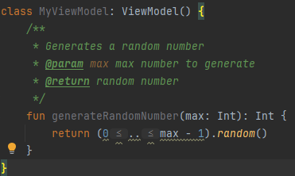

# Simon Dice

Introducción:

En este proyecto, nos sumergiremos en la creación de una versión digital del clásico juego de memoria "Simón Dice". Este juego, que ha entretenido a personas de todas las edades durante décadas, 
desafía tu capacidad para recordar secuencias de colores y sonidos.

Para empezar Creamos las clases Data.kt , MainActivity.kt y MyViewModel en la clase simondicerec

empezamos en el MyViewModel, que es donde se incluyen todos los metodos

# My View Model

1. Implementamos la funcion que genere un número aleatorio.

