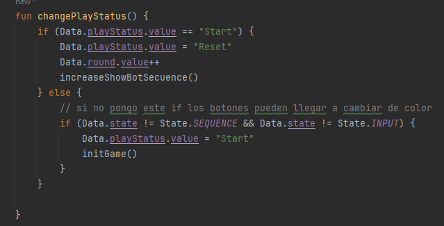

# Simon Dice

Introducción:

En este proyecto, nos sumergiremos en la creación de una versión digital del clásico juego de memoria "Simón Dice". Este juego, que ha entretenido a personas de todas las edades durante décadas, 
desafía tu capacidad para recordar secuencias de colores y sonidos.

Para empezar Creamos las clases Data.kt , MainActivity.kt y MyViewModel en la clase simondicerec

empezamos en el Data, que es donde se incluyen todos los datos para irlos implementando cuando se precise en el viewmodel

# DATA.KT

---

**Data Object Para el juego Simon Dice**

Este objeto `Data` en Kotlin se utiliza para almacenar datos importantes relacionados con el juego "Simón Dice" en Android

- `round`: Número de rondas jugadas.
- `playStatus`: Estado actual del juego (por ejemplo, "Start", "Playing", "GameOver").
- `UserSecuence`: Secuencia de entrada del usuario.
- `botSecuence`: Secuencia generada por el bot del juego.
- `record`: Mejor puntuación del jugador.
- `state`: Estado actual del juego (por ejemplo, `State.START`).
- `colors`: Lista de colores disponibles en el juego.

Estas variables son utilizadas para controlar el flujo del juego, registrar el progreso del jugador y almacenar información relevante para la interfaz de usuario.

--- 

- `colorsMyColors`: Una lista de los colores disponibles en el juego, obtenidos a partir de la enumeración `MyColors.values()`.

- `colorFlag`: Una variable que almacena el color de la bandera actual en el juego. Se inicializa con el color blanco (`Color.White`).

- `colorUserFlag`: Una variable que almacena el color de la bandera seleccionada por el usuario. Se inicializa con el color blanco (`Color.White`).

- `enum class MyColors`: Una enumeración que define los colores disponibles en el juego. Cada color tiene asociado un objeto de estado mutable que almacena su valor actual.

Esta estructura proporciona un medio para gestionar y acceder a los colores utilizados en el juego "Simón Dice", permitiendo un control fácil y centralizado sobre la apariencia visual del juego.

---

Este enum en Kotlin define los diferentes estados posibles del juego "Simón Dice". Que implementaremos en nuestro ViewModel:

- `START`: Indica el estado inicial del juego, donde se establecen las configuraciones iniciales y se prepara para comenzar.

- `SEQUENCE`: Representa el estado en el que el juego muestra la secuencia de colores generada por el bot o la computadora.

- `WAITING`: Indica que el juego está esperando la entrada del jugador después de mostrar la secuencia.

- `INPUT`: Es el estado en el que el jugador está ingresando su propia secuencia de colores en respuesta a la secuencia mostrada.

- `CHECKING`: Representa el estado en el que el juego está verificando si la secuencia ingresada por el jugador es correcta.

- `FINISH`: Indica que el juego ha terminado, ya sea porque el jugador cometió un error o porque completó con éxito todas las rondas.

Esta enumeración proporciona una estructura clara y fácil de entender para representar los diferentes estados del juego "Simón Dice", lo que facilita el control del flujo del juego y la gestión de las interacciones del usuario.

--- 

# MyViewModel

**ViewModel para el Juego "Simón Dice"**

Este ViewModel en Kotlin es responsable de gestionar la lógica del juego "Simón Dice" en una aplicación de Android. Contiene métodos para inicializar el juego, generar números aleatorios, restablecer elementos del juego, gestionar la entrada del usuario, mostrar secuencias, verificar la corrección de la secuencia del usuario y controlar el estado del juego.

**Métodos:**

- `generateRandomNumber(max: Int)`: Genera un número aleatorio dentro del rango especificado.
 

- `initGame()`: Inicializa el juego restableciendo los elementos del juego y estableciendo el estado del juego en `State.START` (Inicio).

- `resetRound()`: Reinicia la ronda actual a 0.

- `resetUserSecuence()`: Borra la secuencia del usuario.

- `resetBotSecuence()`: Borra la secuencia del bot.

- `increaseShowBotSecuence()`: Aumenta la secuencia del bot, muestra la secuencia al usuario y establece el estado del juego en `State.SEQUENCE` (Secuencia).

- `showbotSequence()`: Muestra la secuencia del bot al usuario cambiando los colores de los botones.

- `showButtonPressed(color: MutableState<Color>)`: Cambia el color del botón presionado por el usuario y establece el estado del juego en `State.INPUT` (Entrada).

- `increaseUserSecuence(color: Int)`: Aumenta la secuencia del usuario con el color proporcionado y establece el estado del juego en `State.INPUT`.

- `checkSecuence()`: Verifica si la secuencia del usuario es correcta. Si es correcta, aumenta la ronda y reinicia la secuencia del usuario. Si es incorrecta, termina el juego.

- `getRound()`: Devuelve la ronda actual.

- `getRecord()`: Devuelve el récord actual.

- `changePlayStatus()`: Cambia el estado de juego entre "Start" (Inicio) y "Reset", iniciando o reiniciando el juego según corresponda.

- `getPlayStatus()`: Devuelve el estado actual del juego.

---

